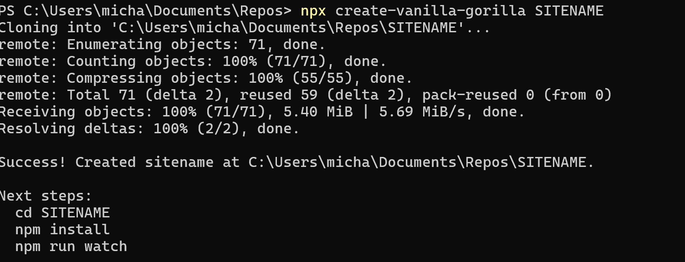

# 🦍 Vanilla Gorilla

Vanilla Gorilla is a minimalist, lightning-fast static site compiler built on pure **Vanilla HTML, CSS, and client-side JavaScript**. It handles the heavy technical lifting of compiling templates, markdown content, and styling so that you can focus on building beautiful sites and content.

The repository is pre-optimized for **agentic workflows**—it includes native `.agents` instructions and skills so your AI assistant can construct pages, write blog posts, and manage style guides on your command.

---
## Demo Site
The official demo is located at <a href="https://vg.exhibita.com" target="_blank">https://vg.exhibita.com</a>.
Other sites include:
- <a href="https://exhibita.com" target="_blank">https://exhibita.com</a> - This is written on the pre-cursor to the Vanilla Gorilla framework and will eventually be moved over to a full implementation of the Vanilla Gorilla framework.
- <a href="https://breezy.camp" target="_blank">https://breezy.camp</a> - COMING SOON: A simple website built for my travelling companion Breezy using the framework.

## 🔥 Let's Fire This Up and get working now!

If you are looking for the easiest way to get started with Vanilla Gorilla Static Site Generator, please follow the steps outlined in the [Easy Start Guide](./docs/EASYSTART.md).

## ⚡ Quickstart Command Reference

### 0. Create your initial folder

If you already have your computer set up for web development, you will most likely already have Node.JS, Git, and GitHub CLI installed and configured. If so, all you will need to do is run the following command from the folder that will be the parent of your SITENAME folder/directory where your project will run.
`npx create-vanilla-gorilla SITENAME`

### 1. Install Dependencies
After running the above command, you'll be presented with your immediate next steps. 

- Obviously, you'll want to `cd SITENAME` to change into the working directory for your project.
- To install the development dependencies (`cheerio` for templates, `chokidar` for watching, `gray-matter` for frontmatter, and `marked` for markdown rendering) you will run `npm install`
- To generate the site you will run `npm run watch`. This command will build the site and automatically monitors your source files for changes and instantly recompiles or restarts your application whenever you save a file. This way the files in the /dist folder will always be current to your saved changes so you can preview file changes in near-realtime.

### 2. Compile the Site
Run a full build after making changes if you haven't kept `npm run watch` running. This cleans the `/dist` directory, minifies the stylesheets, compiles all source HTML and Markdown pages, builds sitemaps and RSS feeds, and writes them to `/dist`:
```bash
npm run build
```

### 3. Create a Prettified Page (Pretty URLs)
To maintain beautiful directory-style URLs (e.g. `/blog/my-post/` instead of `/blog/my-post.html`), Vanilla Gorilla compiles every slug target as `index.html` inside a subfolder named after the slug.

To scaffold a new page or blog post with appropriate relative path nesting:
- **Markdown page (recommended for articles)**:
  ```bash
  npm run create-md -- blog blog/my-new-post
  ```
- **HTML page (for custom layouts)**:
  ```bash
  npm run create-page -- gallery gallery/travel-photos
  ```

---

## 📁 Directory Structure

```
├── .agents/                    # AI Agent workflow configurations and instructions
│   ├── skills/                 # Custom skills equiping AI agents to build pages/styles
│   └── agents.md               # Main instructions defining development team roles
├── .github/
│   └── workflows/
│       └── pages.yml           # GitHub Actions workflow for automatic Pages deployment
├── src/                        # Active Development Source Code
│   ├── css/                    # Custom styling stylesheets (style.css minifies to style.min.css)
│   ├── skeletons/              # Page layouts (blog, gallery) used during scaffolding
│   ├── templates/              # Reusable template components (header.html, footer.html)
│   ├── blog/                   # Blog articles and generated blog listing
│   ├── gallery/                # Image gallery with built-in Lightshow Lightbox
│   └── index.html              # Homepage template
├── dist/                       # Compiled static production-ready output (Git-ignored)
├── build.js                    # Compiler execution script
├── minify.js                   # CSS compression script
├── create-page.js              # Page and article generator scaffolding tool
├── invalidate.js               # CDN cache purger for CloudFront invalidations
├── package.json                # Project script config and dependencies
└── README.md                   # This documentation file
```

---

## 🎨 Design and Layout Features

### Harmonious Earthy Design
The stylesheet `src/css/style.css` provides a simple, light-background organic style built using CSS variables:
*   **Linen background** (`#f8f6f2`) for comfortable reading.
*   **Bark Charcoal** (`#2b2927`) for deep semantic text contrast.
*   **Sage Green** (`#596e57`), **Terracotta Clay** (`#c98263`), and **Ochre Gold** (`#cca05a`) accents.
*   Elegant pairing of `Outfit` (sans-serif) and `Playfair Display` (serif) typography.

### CSS-Only Lightshow Lightbox
The gallery skeleton (`src/skeletons/gallery-skeleton.html`) features a pure-CSS interactive Lightshow lightbox. By targeting elements via the CSS `:target` selector, clicking an image triggers a modal overlay without using a single line of client-side JavaScript. This preserves lightning-fast load times.

### Building Your Own Theme
Want to replace the default look, or port an existing website into Vanilla Gorilla? See [docs/THEMING.md](docs/THEMING.md) for a full guide to the template/skeleton system and a step-by-step conversion walkthrough. We have included a SKILL called design-apply that you can reference directly or by inference to allow the agent(s) to accomplish this task for you.

---

## 🤖 AI Agent Workflow

If you are using an agentic IDE (like Antigravity IDE), the AI assistant is configured to understand your framework layout and rules automatically. You can command your agent to:
*   *“Using the /design-apply skill, can you assist me in applying a new design to my site?”*
*   *“Create a new blog post about vanilla coding.”*
*   *“Generate a new photography gallery page from the gallery skeleton.”*
*   *“Refactor the earthy styling to add a new button component.”*
*   *“Compile and commit the changes to the main branch.”*

## 📄 License

This project is licensed under the GNU Affero General Public License v3 (AGPLv3). See the [LICENSE](file:///./vanilla-gorilla/LICENSE) file for more details.

