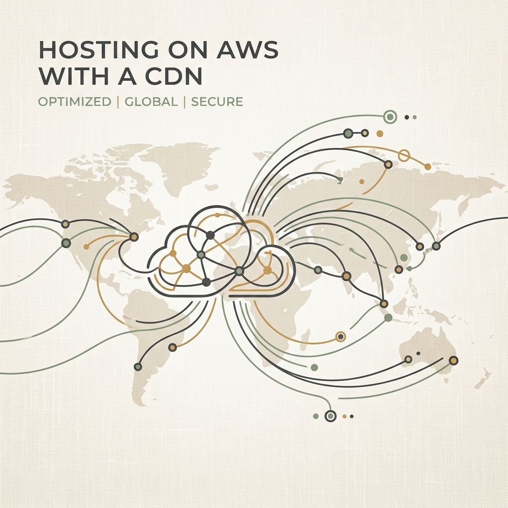

When launching a new website, developers often default to traditional server hosting or managed platforms. However, if your site is compiled into static HTML, CSS, and JS (the exact output generated by **Vanilla Gorilla**), you have access to a hosting architecture that is faster, more durable, and cheaper than almost any traditional server: **Amazon Web Services (AWS) S3 combined with CloudFront CDN**.

Let's break down the massive cost and performance advantages of hosting static sites in the cloud.

### 1. Cost Efficiency (Almost Free)

With traditional hosting, you pay a flat monthly rate for a virtual machine (VM) regardless of whether you receive 10 or 10,000 visitors. If your site gets a traffic spike, you might need to upgrade your tier to prevent it from crashing.

AWS serverless static hosting changes the economics completely:
*   **Pay-For-Use Storage (Amazon S3):** Storing a compiled static website usually takes up less than 50MB. S3 storage costs $0.023 per GB per month. Storing your site costs less than **$0.01 per month**.
*   **Pay-For-Traffic Delivery (Amazon CloudFront):** CloudFront has a generous Free Tier that includes **1 TB of data transfer out per month** and 10 million HTTP requests. For the vast majority of personal blogs, portfolios, and small business sites, CloudFront delivery is **100% free**.
*   **Total Monthly Cost:** Typically **$0.50** (the cost of managing your DNS zone via AWS Route 53).

### 2. High-Performance Speed (Sub-Millisecond TTFB)

A traditional server must process incoming requests, fetch data from a database, assemble the HTML page, and send it back to the client. This introduces latency, measured as Time to First Byte (TTFB).

With S3 and CloudFront:
*   **Content is Pre-Rendered:** There is no database or server-side script to run. The HTML is already fully constructed.
*   **Edge Caching:** CloudFront is a Content Delivery Network (CDN) with hundreds of "edge locations" worldwide. When a visitor requests your page, CloudFront delivers the cached HTML from the server physically closest to them (e.g., in London, Tokyo, or New York).
*   **Global Latency Reduction:** TTFB drops from 200–500ms down to **10–30ms**, making your page transitions feel instant.

### 3. Infinite Scalability & Durability

If your blog post goes viral and hits the front page of Hacker News or Reddit, a standard server will likely crash under the concurrent load. 

An S3 and CloudFront setup is immune to this:
*   **DDoS Protection:** CloudFront natively integrates with AWS Shield, automatically absorbing and mitigating large-scale traffic floods.
*   **Elastic Scaling:** S3 and CloudFront handle tens of thousands of requests per second automatically. You don't have to configure load balancers, auto-scaling groups, or server memory limits.
*   **99.999999999% Durability:** S3 replicates your files across multiple geographic data centers, ensuring your content is never lost due to hardware failure.

### 4. Setting Up AWS S3 & CloudFront

Before you can automate your deployment using GitHub Actions, you need to configure S3 and CloudFront in your AWS Management Console:

#### A. Configure the Amazon S3 Bucket
1. **Create a Bucket:** Go to the S3 console and create a bucket named after your target domain (e.g., `my-website.com`).
2. **Enable Static Website Hosting:** In the bucket's **Properties** tab, scroll to the bottom, enable **Static website hosting**, and specify `index.html` as the Index document. Save the S3 website endpoint URL that is generated.
3. **Disable Public Block Access:** Under the **Permissions** tab, edit "Block public access" and uncheck all boxes (this permits S3 to serve files to public visitors).
4. **Attach a Bucket Policy:** Add the following bucket policy, replacing `my-website.com` with your bucket name, to allow public read access:
   ```json
   {
     "Version": "2012-10-17",
     "Statement": [
       {
         "Sid": "PublicReadGetObject",
         "Effect": "Allow",
         "Principal": "*",
         "Action": "s3:GetObject",
         "Resource": "arn:aws:s3:::my-website.com/*"
       }
     ]
   }
   ```

#### B. Configure Amazon CloudFront
1. **Create Distribution:** In the CloudFront console, click **Create Distribution**.
2. **Origin Domain:** Paste your S3 **website endpoint** URL (e.g. `http://my-website.com.s3-website-us-east-1.amazonaws.com`) into the Origin Domain field. 
   *(Note: Do not select the auto-suggested raw S3 bucket name. Using the website endpoint ensures S3 correctly resolves subfolder indexes and trailing-slash pretty URLs).*
3. **Cache Policy:** Under Default Cache Behavior, choose **Redirect HTTP to HTTPS**. Set the cache policy to **CachingOptimized**.
4. **Save:** Create the distribution and note down the **Distribution ID** and public domain name.

#### C. Collect GitHub Deployment Secrets
To authorize the GitHub Actions deploy workflow, you must generate an IAM User in AWS with `AmazonS3FullAccess` and `CloudFrontFullAccess` permissions. Collect the following information and add them as secrets in your GitHub repository under `Settings -> Secrets and variables -> Actions`:
*   `AWS_ACCESS_KEY_ID` (Your IAM user access key)
*   `AWS_SECRET_ACCESS_KEY` (Your IAM user secret key)
*   `AWS_REGION` (e.g., `us-east-1`)
*   `AWS_S3_BUCKET` (e.g., `my-website.com`)
*   `AWS_CLOUDFRONT_DISTRIBUTION_ID` (Your CloudFront distribution ID)

### How to Deploy Your Vanilla Gorilla Site

To take advantage of this serverless architecture, you have two primary deployment strategies:

#### Strategy A: Automated CI/CD via GitHub Actions (Recommended)
By far the safest and most robust strategy is to push your code to a remote GitHub repository and let GitHub Actions compile and deploy your site automatically. 
*   **Strong Suggestion (Backup Your Site):** We highly recommend backing up your project source code to a private or public GitHub repository. This guarantees that your source content (like your markdown files and skeletal templates) remains safe even if your local computer experiences a failure.
*   **Git Automation:** The project comes with a `.github/workflows/deploy.yml` pipeline that triggers on commits to the `main` branch. 
*   **Command Your Agent:** If you are developing using an agent-compatible editor (like Antigravity IDE), you don't even have to write git commands manually. You can simply command your AI coding assistant:
    > *"Build, commit, and deploy my changes to production."*
    
    The agent will automatically build the static assets locally, verify everything is clean, commit your changes with a conventional commit message, and push them to your GitHub repository. The Action will then run, syncing `./dist/` to S3 and invalidating the CloudFront cache in minutes.

#### Strategy B: Local Command Line Deployment
If you are developing locally and want to push updates manually, make sure you have the AWS CLI installed and configured. Then, run the following steps:
1.  **Compile:** Run `npm run build` to generate the `/dist/` folder.
2.  **Sync:** Upload the files inside `/dist/` to your Amazon S3 bucket:
    ```bash
    aws s3 sync dist/ s3://my-website-bucket --delete
    ```
3.  **Invalidate:** Purge the CloudFront cache so visitors immediately see your new content:
    ```bash
    aws cloudfront create-invalidation --distribution-id MY_DIST_ID --paths "/*"
    ```

By removing the web server from the equation, you eliminate complexity, secure your data, speed up load times, and save money. It's the ultimate setup for the modern, vanilla web.
